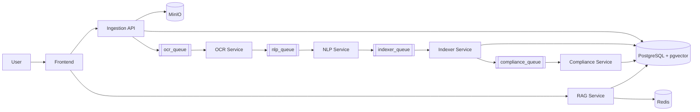

# Integrity Report — P2M Work Overview

## 1. Introduction

P2M is designed to automate tender/document processing from upload to AI-assisted analysis. The platform combines document ingestion, OCR extraction, NLP structuring, vector indexing, compliance analysis, and conversational retrieval in one integrated workflow.

## 2. Problem

Organizations handling tender documents face recurring challenges:
- Large volume of PDF files with mixed structure and languages
- Slow manual extraction of key criteria and deadlines
- Difficulty checking if a company profile matches eligibility conditions
- Limited ability to ask natural-language questions over document content

## 3. Proposed Solution

P2M addresses this by using an event-driven microservices architecture:
- Upload once through the web interface
- Process asynchronously through OCR → NLP → Indexing
- Compute compliance against tenant profile
- Offer real-time RAG chat over processed document knowledge

This design improves automation, traceability, and scalability while decoupling each processing stage.

## 4. Technical View (High-Level)

- **Frontend** handles authentication, upload, AO/tender visualization, notifications, and AI chat.
- **Ingestion API** is the orchestration entrypoint for upload and business APIs.
- **RabbitMQ** decouples workers and controls async pipeline progression.
- **OCR/NLP/Indexer** form the core document processing chain.
- **Compliance service** transforms indexed content into eligibility decisions.
- **RAG service** provides conversational access to indexed knowledge.
- **PostgreSQL + pgvector** centralizes structured and vectorized data.
- **MinIO** stores source PDFs.

### Pipeline explanation
- Upload starts in the frontend and ingestion API, where the file is stored and the first queue event is published.
- The event-driven pipeline then advances in order: `ocr_queue` → `nlp_queue` → `indexer_queue` → `compliance_queue`.
- Each worker consumes one queue, processes one concern, persists results/status, and publishes the next stage event.
- This architecture improves integrity through clear boundaries, traceable transitions, and reduced coupling between services.

## 5. Interfaces

### User-facing interfaces
- Web UI (React)
- RAG WebSocket endpoint (`/rag/ws`)

### Backend APIs (Ingestion)
- Authentication: `/auth/signup`, `/auth/login`
- Upload: `/upload`
- Tenant profile: `/tenants/{tenant_id}`, `/tenants/{tenant_id}/metadata`
- Tenders/compliance summary: `/ao/tenders/{tenant_id}`, `/ao/compliant/{tenant_id}`
- Notifications: `/notifications/*`

### Service-to-service interfaces
- RabbitMQ queues: `ocr_queue`, `nlp_queue`, `indexer_queue`, `compliance_queue`
- Compliance UI event exchange: `ui_events_exchange`

## 6. Integrity Assessment

The current implementation shows strong internal consistency:
- Service boundaries are clear and aligned with pipeline stages.
- Data persistence is centralized and reused across services.
- Queue-based integration reduces coupling and supports retries/DLQ patterns.
- Frontend routes align with backend API and WebSocket endpoints.

Key attention points for future hardening:
- Standardize environment variable management across services
- Consolidate duplicated local-mode vs queue-mode paths where needed
- Add broader automated test coverage and observability metrics

## 7. Conclusion

P2M provides a coherent end-to-end architecture that links document acquisition, AI extraction, compliance decision support, and interactive RAG usage. The work is technically integrated, modular, and suitable for incremental scaling and production hardening.
