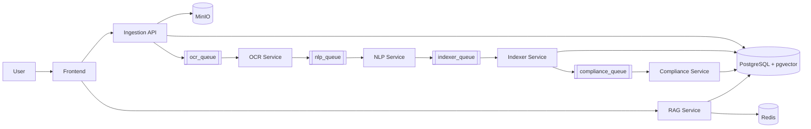

# Technical Report — P2M Platform

## 1. Global Architecture View

P2M is a microservices platform for document ingestion, OCR, NLP processing, indexing, compliance evaluation, and RAG-based Q&A.

### Core flow
1. **Frontend** uploads a PDF to **Ingestion API**.
2. **Ingestion API** stores file in **MinIO**, metadata in **PostgreSQL**, and publishes a task to **RabbitMQ**.
3. **OCR Service** consumes from `ocr_queue`, extracts structured text blocks, and publishes to `nlp_queue`.
4. **NLP Service** consumes from `nlp_queue`, cleans/chunks/translates content, and publishes to `indexer_queue`.
5. **Indexer Service** consumes from `indexer_queue`, generates dense/sparse embeddings, stores chunks in PostgreSQL/pgvector, and triggers compliance.
6. **Compliance Service** consumes from `compliance_queue`, extracts eligibility criteria with an LLM, compares against tenant profile, stores result, and emits UI event.
7. **RAG Service** serves WebSocket chat; retrieves indexed chunks from PostgreSQL and generates responses via Ollama.

### Pipeline explanation
- The processing chain is fully asynchronous and queue-driven.
- Stage progression is `ocr_queue` → `nlp_queue` → `indexer_queue` → `compliance_queue`.
- Each microservice has one clear responsibility: OCR extraction, NLP structuring, embedding/indexing, then eligibility/compliance evaluation.
- This pipeline design supports horizontal scaling, retries/DLQ handling, and resilient stage-by-stage recovery.

### Main shared infrastructure
- **RabbitMQ**: async service-to-service messaging
- **PostgreSQL + pgvector**: documents/chunks/compliance/chat memory storage
- **MinIO (S3-compatible)**: document object storage
- **Redis**: provisioned (for cache/session extension)

---

## 2. Services Architecture (One by One)

## 2.1 Frontend (`front-end/`)
**Role**: user interface for authentication, uploads, notifications, tenders list, tenant profile, and AI chat.

**Main content**
- `src/app/App.tsx`: main app flow, login/signup, tenders and notifications integration
- `src/app/components/AIAgentSpace.tsx`: PDF upload and RAG websocket chat
- `src/app/components/NotificationsPanel.tsx`: notifications UI and actions
- `src/app/components/TenantProfileForm.tsx`: tenant metadata update interface

**Interfaces used**
- HTTP to Ingestion API (`/auth/*`, `/upload`, `/ao/*`, `/notifications/*`, `/tenants/*`)
- WebSocket to RAG service (`/rag/ws`)

**Technologies**
- React, Vite, TypeScript, Tailwind ecosystem, Radix UI, MUI

---

## 2.2 Ingestion Service (`ingestion_service/`)
**Role**: API gateway for upload, tenant/user/auth, and notification endpoints.

**Main content**
- `api.py`: FastAPI routes, MinIO upload, DB insert, pipeline trigger
- `models.py`: SQLAlchemy models (`documents`, `chunks`, `tenants`, `users`, `notifications`, `document_compliance`, `chat_history`)
- `database.py`: SQLAlchemy engine/session setup
- `producer.py`: RabbitMQ publish to OCR queue
- `migrations/`: Alembic migration history

**Flow responsibility**
- Validates PDF uploads
- Stores file to MinIO bucket
- Persists metadata in PostgreSQL
- Triggers processing (`run_pipeline` local mode or RabbitMQ mode)

**Technologies**
- Python, FastAPI, SQLAlchemy, Alembic, MinIO SDK, Pika

---

## 2.3 OCR Service (`ocr_service/`)
**Role**: asynchronous OCR extraction worker.

**Main content**
- `consumer.py`: RabbitMQ async consumer, status updates, retry/DLQ logic
- `main.py`: OCR orchestration entrypoint
- `paddle_ocr.py`, `pdf_to_images.py`: OCR and PDF rendering logic
- `publisher.py`: publish OCR output to NLP queue
- `config.py`: OCR + queue settings

**Flow responsibility**
- Downloads source file from MinIO
- Extracts page blocks and text
- Updates `documents.status` to `ocr_done`/`ocr_failed`
- Publishes OCR payload for NLP stage

**Technologies**
- Python, PaddleOCR, PyMuPDF, aio-pika, asyncpg, MinIO SDK

---

## 2.4 NLP Pipeline Service (`nlp_pipeline_svc/`)
**Role**: text structuring and semantic chunk preparation.

**Main content**
- `consumer.py`: RabbitMQ consumer + retries + status updates
- `app/pipeline.py`: orchestrator (cleaning, language detection, translation, chunking, metadata extraction)
- `app/nlp/*`: NLP modules
- `publisher.py`: publish chunk payload to indexer queue

**Flow responsibility**
- Converts OCR pages into semantic chunks
- Produces normalized English text for embedding
- Updates `documents.status` to `nlp_done`/`nlp_failed`

**Technologies**
- Python, custom NLP pipeline, langdetect/lingua, transformers, spaCy, aio-pika

---

## 2.5 Indexer Service (`indexer_svc/`)
**Role**: embedding generation and vector persistence.

**Main content**
- `consumer.py`: RabbitMQ consumer for NLP output and DB status updates
- `app/embedder.py`: BAAI/bge-m3 dense + sparse embeddings
- `app/store.py`: pgvector upsert logic and schema checks
- `publisher.py`: emits compliance task event

**Flow responsibility**
- Embeds chunks into dense/sparse vectors
- Upserts into `chunks` table (pgvector + sparsevec)
- Updates `documents.status` to `indexed`
- Triggers compliance analysis

**Technologies**
- Python, FlagEmbedding (BGEM3), NumPy, psycopg2, pgvector, aio-pika

---

## 2.6 Compliance Service (`compliance_service/`)
**Role**: automatic eligibility/compliance evaluation against tenant profile.

**Main content**
- `consumer.py`: listens on `compliance_queue`
- `app/extractor.py`: sliding-window LLM extraction + comparison logic + DB persistence
- `publisher.py`: publishes compliance completion event to UI exchange

**Flow responsibility**
- Reads indexed chunks for a document
- Extracts administrative/financial/technical criteria via LLM
- Compares extracted criteria with tenant metadata
- Stores result in `document_compliance`
- Creates notifications and emits completion event

**Technologies**
- Python, aio-pika, SQLAlchemy, httpx, Ollama-compatible LLM endpoint

---

## 2.7 RAG Service (`rag_service/`)
**Role**: interactive retrieval-augmented generation via WebSocket.

**Main content**
- `start_rag.py`: FastAPI app, startup pipeline assembly, health endpoints
- `websocket_handler.py`: websocket session lifecycle
- `pipeline.py`: retrieval + generation orchestration
- `retriever.py`: hybrid retrieval (semantic + BM25 + RRF)
- `generator.py`: token streaming from Ollama
- `memory.py`: chat history persistence in PostgreSQL

**Flow responsibility**
- Receives user query + document id
- Retrieves relevant chunks from `chunks`
- Streams generated response tokens to client
- Saves conversation context for follow-up turns

**Technologies**
- Python, FastAPI WebSocket, asyncpg, pgvector, Ollama, LangChain Postgres memory

---

## 3. Shared Modules

- `shared/models.py`: Pydantic contracts (`OcrDocument`, `NlpDocument`, etc.) used across pipeline boundaries
- `shared/event_bus.py`: local JSON event abstraction (legacy/local mode)

---

## 4. End-to-End Data and Status Lifecycle

- `uploaded` → `processing` → `ocr_processing` → `ocr_done` → `nlp_processing` → `nlp_done` → `indexing` → `indexed`
- Failure states: `ocr_failed`, `nlp_failed`, `index_failed`, `failed`
- Compliance output persisted in `document_compliance` and exposed through ingestion API endpoints

---

## 5. Technology Stack Summary

### Backend
- Python, FastAPI, SQLAlchemy, Alembic
- aio-pika / pika (RabbitMQ), asyncpg/psycopg2
- MinIO SDK, httpx

### AI/NLP/IR
- PaddleOCR, PyMuPDF
- spaCy, transformers, language detection libraries
- FlagEmbedding (BAAI/bge-m3), pgvector
- Ollama-hosted LLM inference

### Frontend
- React + TypeScript + Vite
- Tailwind ecosystem, Radix UI, MUI

### Infrastructure
- Docker Compose
- PostgreSQL + pgvector
- RabbitMQ
- MinIO
- Redis
